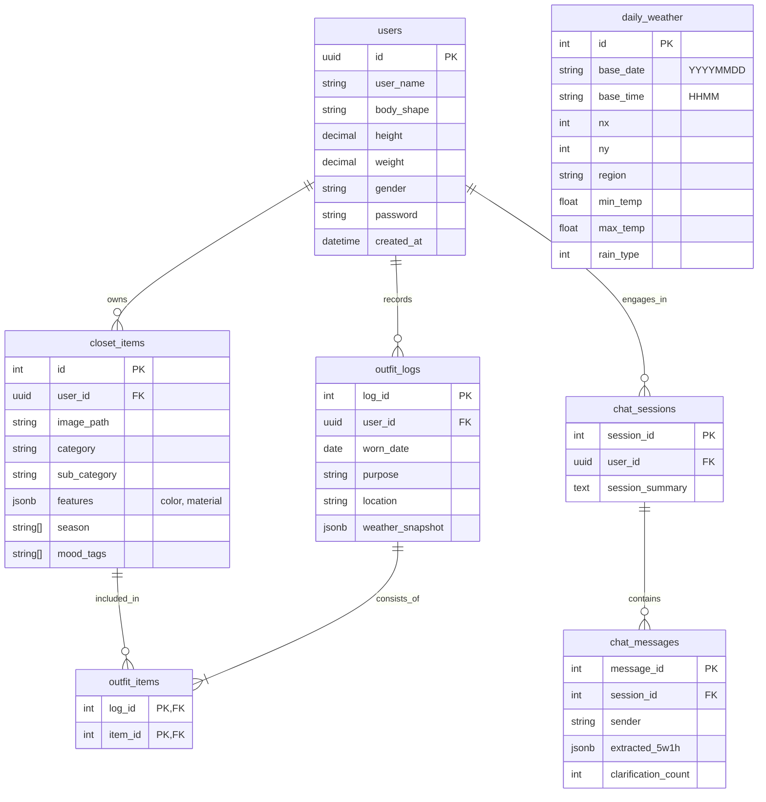
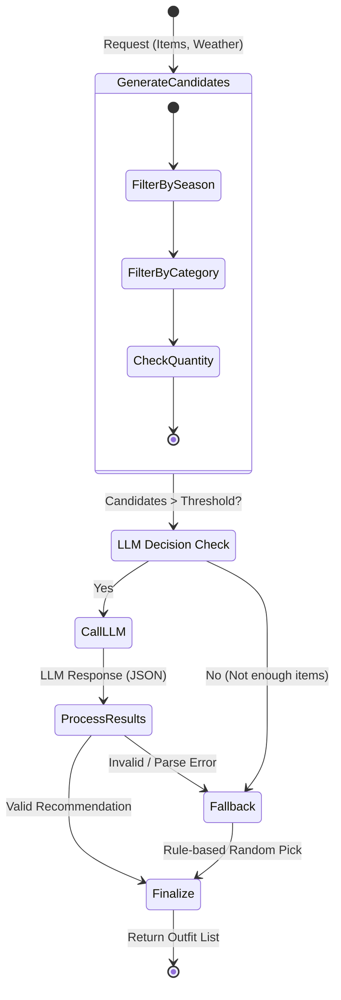
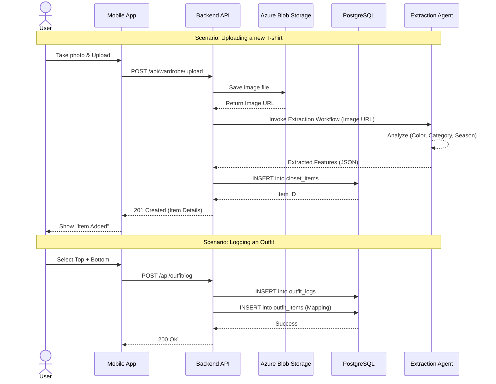

# Database Reference Documentation

## 1. Schema Overview

This document provides a detailed reference for the backend database schema. The database is designed to support a **Personal AI Stylist** application, focusing on user profiles, wardrobe management, daily outfit tracking, and conversational history.

### Key Domains
- **User Core**: Profiles and physical attributes (`users`)
- **Wardrobe**: Clothing items and their attributes (`closet_items`)
- **Activity**: Daily outfit logs and weather context (`outfit_logs`, `daily_weather`)
- **Conversation**: Chat history and memory for the AI agent (`chat_sessions`, `chat_messages`)

---

## 2. Entity-Relationship Diagram (ERD)

This diagram illustrates the relationships between core entities.

---

## 3. Core Workflow Diagrams

### 3.1 Outfit Recommendation Flow (State Diagram)

This state diagram visualizes the decision logic within the `Recommendation Domain`, specifically how the system decides between using an LLM or fallback logic.

### 3.2 User-Wardrobe Interaction (Sequence Diagram)

Visualizes how a user uploads an item and logs an outfit.

---

## 4. Data Dictionary

### 4.1. Users (`users`)
Central entity managing user identity and physical attributes for sizing recommendations.

| Column | Type | Nullable | Description |
|--------|------|----------|-------------|
| `id` | UUID | No | **PK**. Unique identifier (v4). |
| `user_name` | String | No | Display name. |
| `body_shape` | String | Yes | Categorized body shape (e.g., 'Inverted Triangle'). |
| `height` | Decimal(5,2) | Yes | User height in cm. |
| `weight` | Decimal(5,2) | Yes | User weight in kg. |
| `age` | Integer | Yes | User age. |
| `gender` | String | Yes | 'MALE', 'FEMALE', etc. Used for style tuning. |
| `password` | String | No | Hashed password. |
| `created_at` | DateTime | No | Registration timestamp. |

### 4.2. Closet Items (`closet_items`)
Individual clothing items owned by a user.

| Column | Type | Nullable | Description |
|--------|------|----------|-------------|
| `id` | Integer | No | **PK**. Auto-incrementing ID. |
| `user_id` | UUID | No | **FK** -> `users.id`. Owner of the item. |
| `image_path` | String | No | Path to the image in Blob Storage. |
| `category` | String | No | Major category (TOP, BOTTOM, OUTER, etc.). |
| `sub_category` | String | Yes | Detailed category (HOODIE, DENIM, etc.). |
| `features` | JSONB | Yes | AI-extracted features (color, material, thickness). |
| `season` | String[] | Yes | Array of suitable seasons (SPRING, FALL). |
| `mood_tags` | String[] | Yes | Style tags (CASUAL, MINIMAL). |

### 4.3. Outfit Logs (`outfit_logs`)
Record of what a user wore on a specific date, including context.

| Column | Type | Nullable | Description |
|--------|------|----------|-------------|
| `log_id` | Integer | No | **PK**. Auto-incrementing ID. |
| `user_id` | UUID | No | **FK** -> `users.id`. |
| `worn_date` | Date | No | The date the outfit was worn. |
| `purpose` | String | Yes | TPO context (e.g., "Date", "Office"). |
| `location` | String | Yes | Location string. |
| `weather_snapshot` | JSONB | Yes | Cached weather data at the time of wearing. |

### 4.4. Outfit Items (`outfit_items`)
Join table linking Logs to Closet Items (Many-to-Many resolution).

| Column | Type | Nullable | Description |
|--------|------|----------|-------------|
| `log_id` | Integer | No | **PK, FK** -> `outfit_logs.log_id`. |
| `item_id` | Integer | No | **PK, FK** -> `closet_items.id`. |

### 4.5. Daily Weather (`daily_weather`)
Cached weather data fetched from KMA (Korea Meteorological Administration).

| Column | Type | Nullable | Description |
|--------|------|----------|-------------|
| `id` | Integer | No | **PK**. |
| `base_date` | String(8) | No | Target date (YYYYMMDD). |
| `nx` | Integer | No | Grid X coordinate. |
| `ny` | Integer | No | Grid Y coordinate. |
| `region` | String | Yes | Human-readable region name (e.g., "Seoul"). |
| `min_temp` | Float | Yes | Minimum temperature (TMN). |
| `max_temp` | Float | Yes | Maximum temperature (TMX). |
| `rain_type` | Integer | Yes | Precipitation type code (0:None, 1:Rain, etc.). |

### 4.6. Chat Sessions (`chat_sessions`)
Groups interaction history between User and AI Agent.

| Column | Type | Nullable | Description |
|--------|------|----------|-------------|
| `session_id` | Integer | No | **PK**. |
| `user_id` | UUID | No | **FK** -> `users.id`. |
| `session_summary` | Text | Yes | LLM-generated summary of long-term context. |

### 4.7. Chat Messages (`chat_messages`)
Individual messages within a session.

| Column | Type | Nullable | Description |
|--------|------|----------|-------------|
| `message_id` | Integer | No | **PK**. |
| `session_id` | Integer | No | **FK** -> `chat_sessions.session_id`. |
| `sender` | String | No | 'USER' or 'AGENT'. |
| `extracted_5w1h` | JSONB | Yes | Structured intent extracted from the message. |
| `clarification_count`| Integer | No | Counter for how many times AI asked for clarification. |
