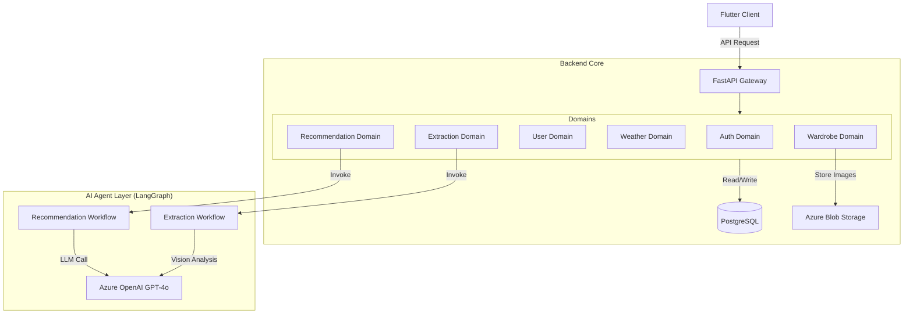
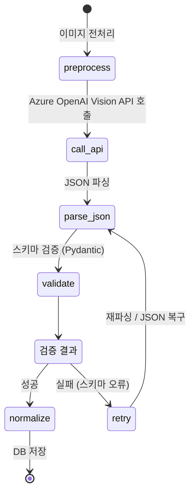
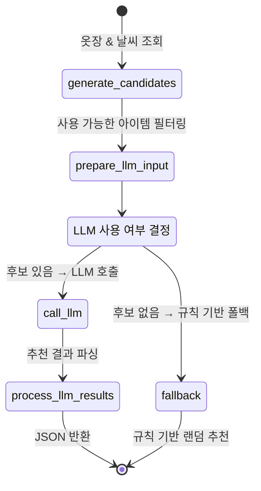
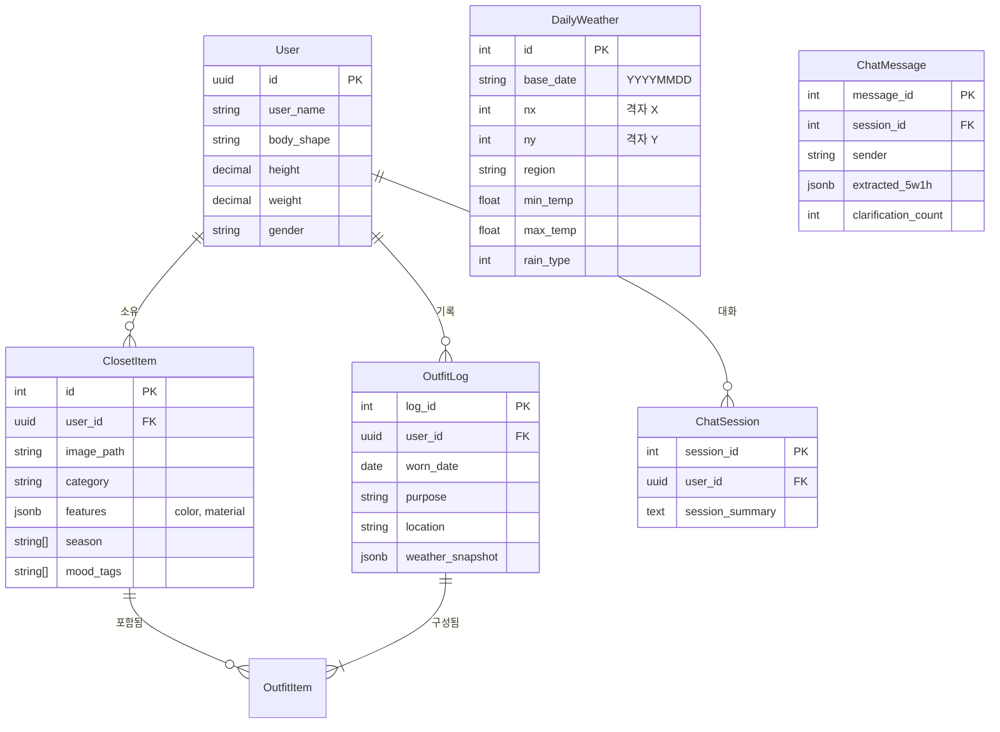

# 발표용 문서 (Presentation Content)

## 📋 목차
1. [프로젝트 개요](#1-프로젝트-개요)
2. [시스템 아키텍처](#2-시스템-아키텍처)
3. [핵심 AI 워크플로우](#3-핵심-ai-워크플로우)
4. [데이터베이스 설계](#4-데이터베이스-설계)
5. [기술 스택 및 주요 특징](#5-기술-스택-및-주요-특징)
6. [리팩토링 여정](#6-리팩토링-여정)
7. [향후 계획](#7-향후-계획)

---

## 1. 프로젝트 개요

### Personal AI Stylist Backend
- **목적**: AI 기반 개인 스타일리스트 백엔드 시스템
- **핵심 기능**:
  - 옷 이미지 자동 속성 추출 (카테고리, 색상, 소재, 계절 등)
  - 날씨 기반 코디 추천
  - 옷장 관리 및 일일 코디 기록
- **대상 사용자**: 개인 맞춤형 스타일링을 원하는 사용자

---

## 2. 시스템 아키텍처

시스템은 **Domain-Driven Design (DDD)** 패턴을 따르며, **LangGraph**를 활용한 상태 기반 AI 워크플로우로 구성됩니다.



### 아키텍처 특징
- **도메인 분리**: 각 도메인(인증, 옷장, 날씨, 추천, 추출)이 독립적으로 관리
- **AI 워크플로우**: LangGraph를 통한 상태 기반 AI 로직 처리
- **확장성**: 새로운 도메인 추가 시 기존 코드 수정 최소화

---

## 3. 핵심 AI 워크플로우

### 3.1 이미지 속성 추출 워크플로우 (Extraction Workflow)

업로드된 옷 이미지에서 자동으로 속성을 추출합니다.



**추출 속성**:
- 카테고리 (상의/하의, 세부 카테고리)
- 색상 (주색상, 보조색상, HEX 코드)
- 패턴 (무늬 유형)
- 소재 (면, 폴리에스터 등)
- 계절성 (봄/여름/가을/겨울)
- 스타일 태그 (캐주얼, 포멀 등)

### 3.2 코디 추천 워크플로우 (Recommendation Workflow)

날씨와 사용자 요청을 고려한 코디를 추천합니다.



**추천 로직**:
- 규칙 기반 후보 생성 (모든 상의×하의 조합)
- 점수 계산 (색상 조화, 스타일 일치, 날씨 적합성)
- LLM을 통한 개인화된 추천 (TPO, 날씨 고려)
- LLM 실패 시 규칙 기반 폴백 제공

---

## 4. 데이터베이스 설계

사용자 옷장 관리 및 일일 코디 기록을 위한 데이터베이스 구조입니다.



### 주요 엔티티
- **User**: 사용자 프로필 및 신체 정보
- **ClosetItem**: 옷장 아이템 (AI 추출 속성 포함)
- **OutfitLog**: 일일 코디 기록 (날씨 스냅샷 포함)
- **DailyWeather**: 기상청 날씨 데이터 (배치로 수집)
- **ChatSession/ChatMessage**: AI 대화 세션 및 메시지

---

## 5. 기술 스택 및 주요 특징

### 기술 스택
- **Backend Framework**: FastAPI (Python 3.12+)
- **AI/ML**: Azure OpenAI GPT-4o (Vision API)
- **Workflow Engine**: LangGraph
- **Database**: PostgreSQL
- **Storage**: Azure Blob Storage
- **Deployment**: Azure Functions

### 주요 특징

#### 1. Domain-Driven Design (DDD)
- 도메인별 독립적인 모듈 구조
- 각 도메인이 자신의 책임만 담당
- 새로운 기능 추가 시 기존 코드 영향 최소화

#### 2. LangGraph 기반 AI 워크플로우
- 상태 기반 워크플로우 관리
- 명시적인 재시도 및 분기 로직
- 에러 처리 및 폴백 메커니즘 내장

#### 3. 자동화된 날씨 데이터 수집
- 매일 02:16 KST 자동 배치 실행
- 전국 17개 지역 병렬 수집
- 멱등성 보장 (중복 방지)

#### 4. 견고한 에러 처리
- 스키마 검증 실패 시 자동 재시도
- LLM 실패 시 규칙 기반 폴백
- Graceful degradation 패턴

---

## 6. 리팩토링 여정

### Phase 1: 모놀리식 과거 (Legacy)
**문제점**:
- 모든 로직이 `main.py` 또는 거대한 `utils.py`에 집중
- "Weather" 로직과 "Recommendation" 로직의 경계 불명확
- 새 기능 추가 시 기존 기능 깨짐
- AI 호출이 선형 스크립트 → 한 단계 실패 시 전체 실패

### Phase 2: 도메인 기반 현재 (Current)
**개선 사항**:
- **모듈화**: `domains/wardrobe`는 옷장만 담당
- **안정성**: AI 로직을 StateGraphs(LangGraph)로 이동 → 재시도 및 분기 명시화
- **확장성**: 새 기능(예: "Generation")을 새 폴더로 추가, 기존 코드 수정 없음

**주요 변경사항**:
```
Before: main.py (1000+ lines)
After: 
  - domains/auth/
  - domains/wardrobe/
  - domains/weather/
  - domains/recommendation/
  - domains/extraction/
  - ai/workflows/ (LangGraph)
```

### Phase 3: 에이전트 기반 미래 (Roadmap)
**목표**: 자율적인 개인 스타일리스트

**계획**:
- **Active Learning**: "OOTD" 로그로부터 학습하여 추천 개선
- **Multi-Modal Interaction**: 음성 + 이미지 + 텍스트 채팅 인터페이스
- **Microservices**: 트래픽 증가 시 `Extraction`과 `Recommendation`을 별도 컨테이너로 분리

---

## 7. 향후 계획

### 단기 (1-3개월)
- [ ] 사용자 피드백 기반 추천 개선
- [ ] 채팅 인터페이스 고도화
- [ ] 성능 최적화 (캐싱, 병렬 처리)

### 중기 (3-6개월)
- [ ] 음성 입력 지원
- [ ] 스타일 트렌드 분석 기능
- [ ] 소셜 기능 (코디 공유)

### 장기 (6개월+)
- [ ] 마이크로서비스 아키텍처 전환
- [ ] 실시간 스타일 추천 (스트리밍)
- [ ] AR 가상 피팅 기능 연동

---

## 📚 관련 문서

- [데이터베이스 상세 문서](database_reference.md)
- [API 문서](api/)
- [아키텍처 문서](architecture/)
- [개발 가이드](development/rules.md)

---

**마지막 업데이트**: 2025-01-26
