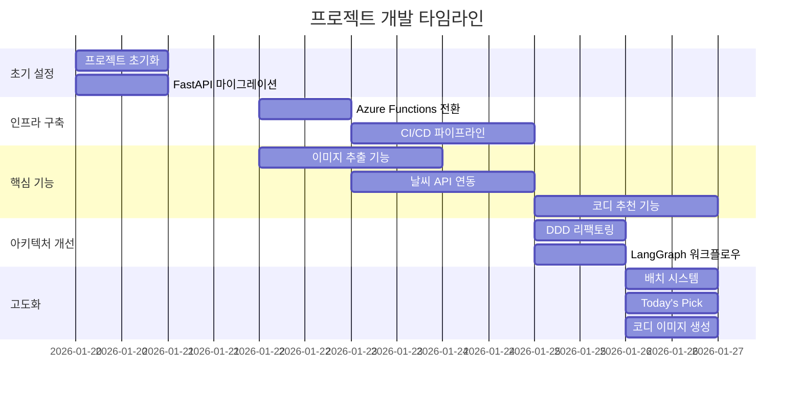

# 프로젝트 타임라인 (Project Timeline)

이 문서는 Personal AI Stylist Backend 프로젝트의 개발 타임라인을 Git 커밋 기록과 GitHub 이슈/PR을 기반으로 작성했습니다.

## 📅 전체 타임라인 개요

프로젝트는 **2026년 1월 20일**에 시작되어 **2026년 1월 26일**까지 약 1주일간 집중 개발되었습니다.



---

## 📆 상세 타임라인

### 2026년 1월 20일 (화) - 프로젝트 시작

#### 주요 작업
- ✅ 프로젝트 초기 설정 및 Git 리포지토리 생성
- ✅ FastAPI 기반 백엔드 구조 설계
- ✅ 모듈화된 API 서버 구조 구축 (`app/` 디렉토리 구조)

#### 주요 커밋
- `5888334` - first commit
- `a7ad615` - Refactor: Migrate to FastAPI with Pydantic models
- `b8c0701` - Refactor: Modularize api_server to app directory structure

#### 특징
- 모놀리식 구조에서 모듈화된 구조로 전환 시작
- FastAPI와 Pydantic을 활용한 타입 안전성 확보

---

### 2026년 1월 21일 (수) - 개발 환경 설정

#### 주요 작업
- ✅ 개발 환경 설정 (VSCode, Python 버전 관리)
- ✅ 프로젝트 구조 정리

#### 주요 커밋
- `47d2b84` - .vscode state change
- `60a738d` - .vscode setting
- `9aed545` - Chore: vscode setting 정리

---

### 2026년 1월 22일 (목) - 핵심 기능 개발 시작

#### 주요 작업
- ✅ Azure Functions로 배포 환경 전환 (PR #10, #14)
- ✅ Azure Blob Storage 연동 및 이미지 업로드 기능 (PR #8, #12)
- ✅ Azure OpenAI API 연동 (Gemini에서 전환)
- ✅ 이미지 특징 추출 기능 초기 구현
- ✅ 날씨 API 연동 시작
- ✅ CI/CD 파이프라인 초기 설정 (Azure Pipelines)

#### 주요 커밋
- `83afa03` - feat: Migrate to Azure Functions (#10)
- `39a2e84` - Merge pull request #12: Azure Blob Storage 업로드
- `3cf7b13` - gemini에서 AZURE Open AI API로 변경 및 PYCACHE .gitignore에 추가
- `c2503ba` - 이미지 저장 경로 형식 지정 및 이미지 저장 구현
- `df76b78` - Set up CI with Azure Pipelines For BackEnd
- `1f15edc` - Merge pull request #7: azure-pipelines

#### 특징
- 클라우드 인프라 (Azure Functions, Blob Storage) 도입
- CI/CD 자동화 시작
- AI 모델을 Azure OpenAI로 통일

---

### 2026년 1월 23일 (금) - 기능 확장 및 통합

#### 주요 작업
- ✅ ORM 테이블 구조 구현 (PR #19, #20)
- ✅ 사용자 인증 및 프로필 관리 기능
- ✅ 이미지 업로드와 특징 추출 로직 통합 (PR #21, #24)
- ✅ 날씨 데이터 파싱 및 저장 기능 (PR #27, #28)
- ✅ User ID를 UUID로 변경 및 이미지 저장 경로 개선 (PR #25, #29)
- ✅ CI/CD 파이프라인 안정화 작업

#### 주요 커밋
- `052dadb` - Merge pull request #19: feature/orm-tables
- `b0b45aa` - feat: Implement Auth, Profile Edit, and Image Extraction with ORM Integration
- `5c3e78b` - Merge pull request #24: 사진 업로드와 특징 추출 로직 통합
- `f5553fa` - 사진 업로드와 특징 추출 로직을 합치고, 사진은 blobstorage에 저장하고, 특징은 DB에 저장함
- `1e5adda` - Merge pull request #28: 날씨 데이터 추가
- `fe2e968` - feat: User ID를 UUID로 변경 및 이미지 저장 경로 개선
- `546b7f3` - Configure CI/CD pipeline with Azure Functions deployment

#### 특징
- 데이터베이스 스키마 정립 (ORM 기반)
- 사용자 인증 시스템 구축
- 이미지 처리 파이프라인 완성

---

### 2026년 1월 24일 (금) - 테스트 및 문서화

#### 주요 작업
- ✅ 테스트 환경 구축 (Pytest) (PR #30, #31)
- ✅ 문서 구조 생성 및 개발 가이드 작성
- ✅ 날씨 API 리팩토링 및 지역 지원 추가 (PR #32)
- ✅ VSCode 디버깅 설정 추가
- ✅ CI/CD 파이프라인 안정화 및 헬스체크 구현

#### 주요 커밋
- `63260ae` - Merge pull request #31: tests-docs-venv
- `2043bf6` - Add: backend tests and docs structure
- `96852c4` - vs code 디버깅 추가
- `c0672ae` - Merge pull request #32: refactor/weather-refactoring
- `6fedbec` - feat: update weather API with region support and improve caching logic
- `48d87b2` - Fix: ci/cd healthCheck bug fix

#### 특징
- 테스트 기반 개발 환경 구축
- 문서화 체계 정립
- 날씨 API 고도화 (지역별 지원, 캐싱)

---

### 2026년 1월 25일 (토) - 아키텍처 대전환

#### 주요 작업
- ✅ **Domain-Driven Design (DDD) 아키텍처로 전면 리팩토링** (PR #36, #37)
- ✅ 모놀리식 스키마를 도메인별 모듈로 분리
- ✅ 옷장 무한 스크롤 및 SAS 토큰 보안 구현 (PR #35)
- ✅ 날씨 API 에러 처리 개선 및 CI 최적화 (PR #34)
- ✅ 정적 이미지 관리 개선 (PR #45)

#### 주요 커밋
- `bc44aa4` - Merge pull request #37: refactor/#36-backend-architecture
- `b3b87c8` - refactor: Complete Domain-Driven Design architecture
- `36cc7b4` - refactor: Split monolithic schemas.py into modular schemas
- `172cc26` - docs: Update README to reflect Domain-Driven Design architecture
- `ff206a1` - Merge pull request #35: wardrobe-infinite-scroll
- `6eb56f7` - feat: Implement secure SAS token access, dynamic container handling
- `2c147b2` - Merge pull request #34: feature/weather-api-update
- `c049839` - feat: enhance weather api error handling and optimize ci with uv

#### 특징
- **아키텍처 전환의 핵심 시점**
- 모놀리식 구조 → 도메인 기반 모듈화
- 확장 가능한 구조로 전환
- 보안 강화 (SAS 토큰)

---

### 2026년 1월 26일 (일) - 고도화 및 완성

#### 주요 작업
- ✅ **Today's Pick (오늘의 추천 코디) 기능 구현** (PR #46, #53)
- ✅ **날씨 데이터 배치 시스템 구현** (PR #55, #57)
  - Azure Functions Time Trigger (매일 02:16 KST 자동 실행)
  - 전국 17개 지역 병렬 수집
- ✅ **코디 이미지 생성 기능 (DALL-E 3)** (PR #47, #58)
- ✅ 추출/추천 프롬프트 개선 (PR #44, #54)
- ✅ 테스트 환경 안정화 (PR #39, #40, #51)
- ✅ OpenAPI 인증 수정 (PR #49)

#### 주요 커밋
- `8b84a1b` - Merge pull request #53: feat/#46-todays-pick
- `8247608` - Today's Pick (오늘의 추천 코디) API 구현
- `0e4313d` - 추출된 특징과 날씨를 기반으로 사용자에게 코디 추천
- `7c4b770` - Merge pull request #57: 날씨 데이터 배치 구현
- `48edb9d` - feat(functions): 날씨 배치 Time Trigger 구현
- `cc04c52` - feat(weather): 배치 날씨 수집 로직 구현
- `16d4fa5` - docs: 날씨 배치 시스템 문서 작성
- `cbc8e38` - Merge pull request #58: feat/#47-generate-rec-image
- `79a399b` - 코디 이미지 생성 로직 추가(dalle3)
- `f7d29c8` - Merge pull request #60: 날씨 배치 관련 로직 개선
- `1086a02` - refactor: fetchAndLoadWeather 배치 DB 접근 방식으로 개선

#### 특징
- **핵심 기능 완성**: Today's Pick, 배치 시스템, 이미지 생성
- 프로덕션 준비 완료
- 자동화된 데이터 수집 시스템 구축

---

## 🎯 주요 마일스톤

### Milestone 1: 프로젝트 초기화 (2026-01-20)
- ✅ FastAPI 기반 백엔드 구조 설계
- ✅ 모듈화된 디렉토리 구조 구축

### Milestone 2: 클라우드 인프라 구축 (2026-01-22)
- ✅ Azure Functions 배포 환경 구축
- ✅ Azure Blob Storage 연동
- ✅ Azure OpenAI API 통합

### Milestone 3: 핵심 기능 구현 (2026-01-23)
- ✅ 사용자 인증 시스템
- ✅ 이미지 업로드 및 특징 추출 파이프라인
- ✅ 날씨 데이터 수집 및 저장

### Milestone 4: 아키텍처 전환 (2026-01-25)
- ✅ Domain-Driven Design (DDD) 아키텍처로 전면 리팩토링
- ✅ 도메인별 모듈 분리 완료
- ✅ 확장 가능한 구조 확립

### Milestone 5: 프로덕션 준비 (2026-01-26)
- ✅ Today's Pick 기능 완성
- ✅ 자동화된 배치 시스템 구축
- ✅ 코디 이미지 생성 기능 추가

---

## 📊 개발 통계

### 커밋 통계
- **총 커밋 수**: 100+ 커밋
- **활발한 개발 기간**: 7일 (2026-01-20 ~ 2026-01-26)
- **평균 일일 커밋**: 약 14개

### Pull Request 통계
주요 PR들:
- **#37**: DDD 아키텍처 리팩토링 (가장 큰 변경)
- **#57**: 날씨 배치 시스템 구현
- **#53**: Today's Pick 기능
- **#58**: 코디 이미지 생성 (DALL-E)
- **#35**: 옷장 무한 스크롤 및 보안 강화
- **#31**: 테스트 및 문서화

### 주요 기여자
- `choeseonghyeon` - 아키텍처 리팩토링, 테스트 구축
- `Uncommonness` - 핵심 기능 개발 (추출, 추천)
- `Louishstyle` - 날씨 배치 시스템
- `UserK` - 인프라 및 CI/CD
- `Yoonsik-Shin` - CI/CD 파이프라인
- `chjcmy` - PR 리뷰 및 머지 관리

---

## 🔄 주요 리팩토링 이벤트

### 1. FastAPI 마이그레이션 (2026-01-20)
**Before**: 모놀리식 API 서버  
**After**: FastAPI 기반 모듈화 구조

### 2. Azure Functions 전환 (2026-01-22)
**Before**: 일반 웹 서버  
**After**: 서버리스 아키텍처 (Azure Functions)

### 3. DDD 아키텍처 전환 (2026-01-25) ⭐
**Before**: 
```
app/
├── main.py (1000+ lines)
├── utils.py (거대한 유틸리티)
└── schemas.py (모든 스키마)
```

**After**:
```
app/
├── domains/
│   ├── auth/
│   ├── wardrobe/
│   ├── weather/
│   ├── recommendation/
│   ├── extraction/
│   └── user/
├── ai/
│   └── workflows/ (LangGraph)
└── main.py (라우팅만)
```

### 4. 배치 시스템 도입 (2026-01-26)
**Before**: 수동 날씨 데이터 수집  
**After**: 자동화된 배치 시스템 (매일 02:16 KST)

---

## 🚀 기술 스택 진화

### 초기 (2026-01-20)
- Python 3.12+
- FastAPI
- SQLAlchemy (ORM)

### 중기 (2026-01-22)
- Azure Functions
- Azure Blob Storage
- Azure OpenAI (GPT-4o)
- Azure Pipelines (CI/CD)

### 현재 (2026-01-26)
- Domain-Driven Design (DDD)
- LangGraph (AI 워크플로우)
- Pytest (테스트)
- Alembic (마이그레이션)
- DALL-E 3 (이미지 생성)

---

## 📝 참고 자료

### Git 히스토리
```bash
# 전체 커밋 히스토리 확인
git log --oneline --all --graph --decorate -100

# 날짜별 커밋 통계
git log --pretty=format:"%ad" --date=short --all | Sort-Object -Unique
```

### GitHub 리포지토리
- **Repository**: https://github.com/MyClo1234/backend
- **Main Branch**: `main`
- **Development Branch**: `dev`

### 관련 문서
- [프로젝트 개요](presentation_content.md)
- [데이터베이스 설계](database_reference.md)
- [아키텍처 문서](architecture/langgraph-flows.md)
- [API 문서](api/)

---

**마지막 업데이트**: 2026-01-26  
**문서 작성 기준**: Git 커밋 히스토리 및 GitHub PR 분석
